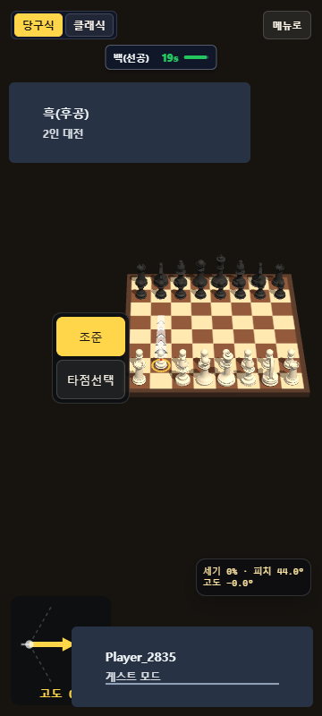
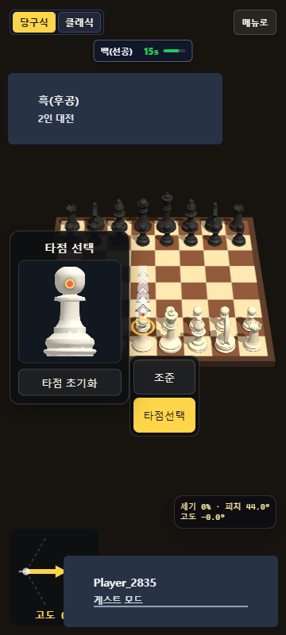
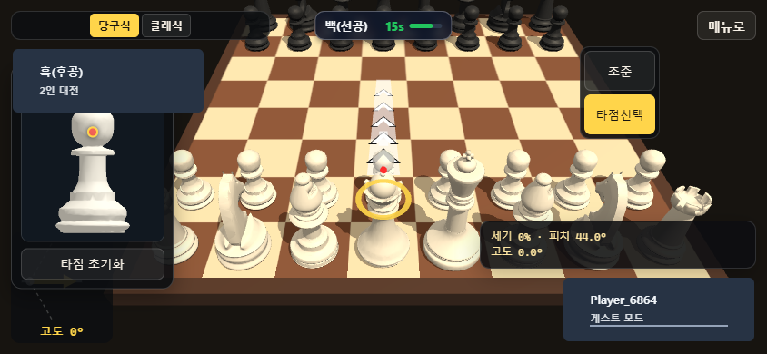
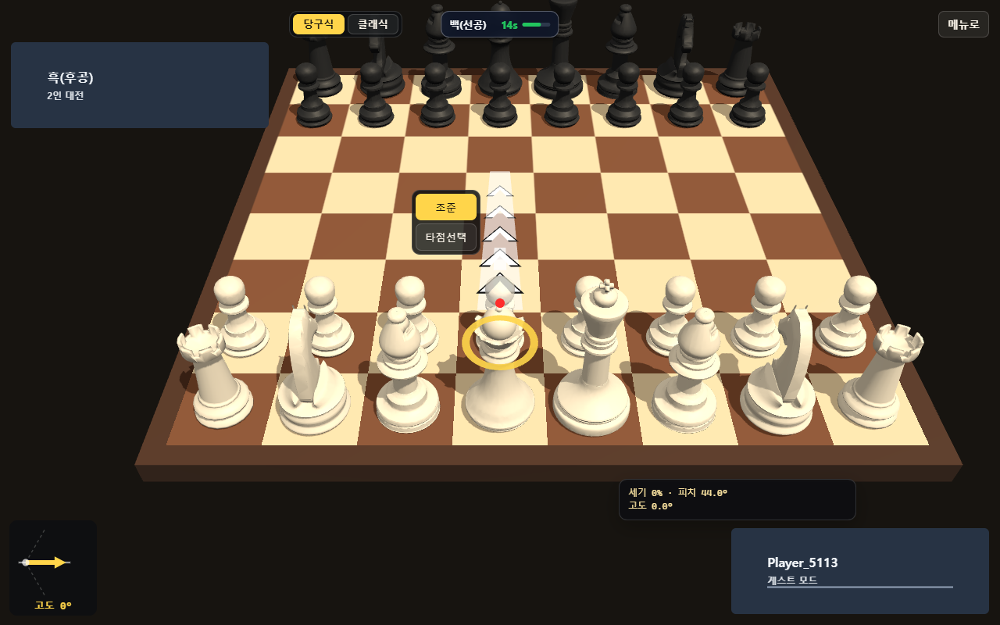
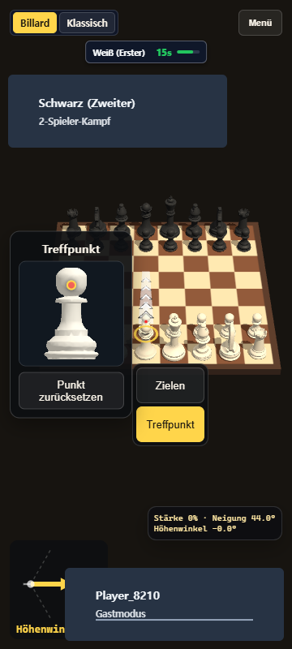

# 타점 선택·조작판 재검증 및 수정

점검 대상: `HUMAN_QA_STRIKE_HUD_2026-10-07.md`의 STRIKE-01, HUD-01. 시작 Git 기준점은 `150c7ad` (`develop`)이며, 원래 문서와 관계없는 기존 로컬 변경은 작업 범위에서 제외했다.

## 재현과 변경

| 항목 | 현재 소스에서 재확인한 문제 | 수정 |
| --- | --- | --- |
| STRIKE-01 | 390×844에서 타점을 지정한 뒤 빈 캔버스를 터치하면 선택이 사라졌다. 같은 위치의 마우스 클릭은 타점 창을 유지했다. | 짧은 바깥 탭·클릭은 현재 말과 지정 타점을 유지하고 조준으로 복귀한다. 적용 입력은 여기서 종료하며 실제 발사나 다른 말 선택으로 연결하지 않는다. |
| HUD-01 | 360×800에서 조작판과 주변 8개 기물의 투영 외곽이 겹치는 것을 브라우저에서 확인했다. 기존 배치 함수는 주변 기물을 받지 않았다. | 모든 보이는 기물과 기존 HUD의 화면 영역을 배치 함수에 전달한다. 가까운 빈 영역을 우선하며 밀집된 경우 화면의 여유 공간도 검사한다. 선택 말의 12px 간격을 모든 대체 후보에도 적용한다. |
| 버튼 문구 | ‘발사’ 버튼은 실제 발사가 아니라 조준 모드 선택이었다. | 이 버튼에서만 사용되는 번역을 9개 언어 모두 실제 동작에 맞춰 수정했다. 한국어는 ‘조준’이다. |
| 조준 정보 가림 | 수정 중 1280×800 캡처에서 기물을 피한 조작판이 조준 화살표 일부를 가리는 것을 추가로 확인했다. | 조준 화살표의 투영 외곽과 빨간 점의 24px 입력 반경도 피한다. 기존 조준 피드백을 가리지 않는 범위로 같은 배치 수정을 보완했다. |

입력 흐름은 **말 선택 → 타점 편집 → 타점 지정 → 바깥 탭 또는 조준 버튼 → 빨간 점 당기기 → 실제 발사 → 상대 턴**이다. 타점은 미리보기에서 지정하는 순간 반영된다. 새 저장 단계나 발사 지연은 추가하지 않았다.

- 미리보기 안에서는 타점을 수정하며, 선택한 말의 실제 표면을 누르는 기존 타점 조작도 유지한다.
- 다른 말을 누르면 첫 탭은 현재 타점 편집을 끝내고, 다음 탭부터 다른 말을 선택한다.
- 바깥 드래그와 두 손가락 조작은 카메라 조작으로 유지한다. 포인터 취소는 타점을 적용하거나 발사하지 않는다.
- 초기화·메뉴·모드 버튼은 각 버튼의 기존 동작을 수행한다. 실제 발사, 선택 해제, 게임 종료·재진입의 정리 경로도 유지한다.
- 기존 금색 선택 표시, 팀 색상, 기물 모델, 타점 표시와 손가락용 버튼 크기는 보존했다. 새 효과·사운드·장식은 추가하지 않았다.

## 검증

브라우저 검증은 `web/src/tools/strike-hud-browser-check.mjs`로 재실행할 수 있다. 별도 테스트 Vite 서버에서 런타임 참조와 투영 함수만 관찰용으로 노출하며 입력·물리·게임 규칙은 원래 코드를 실행한다. 외부 요청을 차단하고 로컬 게스트·기본 체스판·2인 대전을 사용한다. 계정·운영 데이터나 온라인 경기는 사용하지 않는다.

```powershell
# 기존 Playwright 설치를 쓰는 경우 PLAYWRIGHT_MODULE에 해당 index.mjs의 file URL을 지정한다.
cd web
node src/tools/strike-hud-browser-check.mjs
node src/tools/action-bar-placement-check.mjs
node src/tools/touch-input-headless-check.mjs
node src/tools/selection-check.mjs
npm run check:regressions
npm run build:staging
```

Edge/Chromium **154.0.4258.62**에서 아래 검사를 실행했다. 각 크기별 새 브라우저 컨텍스트를 사용했다. 독일어 검사는 배치와 터치 크기에 한정하며, 한국어의 전체 입력 흐름 검사와 구분한다.

| 검사 | 실행 범위 | 결과 |
| --- | --- | --- |
| 전체 터치 흐름 | 360×800, 390×844, 844×390 | 통과: 적용 시 선택·타점 유지와 발사 없음, 재편집, 초기화, 다른 말의 첫/두 번째 탭, 카메라 드래그, 두 손가락, 포인터 취소, 실제 발사·상대 턴, 메뉴 복귀·재진입 |
| 전체 마우스 흐름 | 1280×800 | 통과: 적용·타점 유지, 재편집, 초기화, 다른 말 선택, 카메라 드래그, 실제 발사와 재진입. 두 손가락 검사는 해당 없음 |
| 실제 화면 배치 | 위 4개 크기의 중앙·좌우 끝 기물, 편집 창 표시/닫힘, 카메라 회전 뒤 | 통과: 조작판이 주변 기물·조준 화살표·빨간 점 입력 영역·기존 HUD를 가리거나 화면을 벗어나지 않음, 정지 상태에서 불필요한 위치 변화 없음 |
| 긴 번역 문구 | 독일어, 360×800 | 통과: 양끝 기물과 타점 창 배치, 44×44px 이상의 터치 버튼 유지 |
| 배치 계산 계약 | `action-bar-placement-check.mjs` 11개 묶음 | 통과: 기존 호출, 이웃·군집·패널 회피, 가로/세로·좌표 오프셋, 공간 부족 폴백, 결정론적 배치, 선택 말 간격, 좁은 통로와 소수 좌표 |
| 기존 입력·선택 검사 | `touch-input-headless-check.mjs`, `selection-check.mjs` | 통과 |
| 일반 회귀 검사 | `npm run check:regressions` | 통과 |
| 타입 검사·staging 빌드 | `npm run build:staging` 및 선행 balance/staging 검사 | 통과. 기존 큰 청크·중복 정적/동적 import 경고는 남아 있음 |

브라우저 결과는 [browser-results.json](qa/strike-hud-2026-10-08/browser-results.json)에 저장했다. 검사는 실제 게임 상태의 선택 ID·타점 벡터·턴·포인터 정리와 화면 영역을 함께 확인한다. 짧은 터치는 30ms 누르고 놓고, 발사는 당기기를 나눠 입력하며 턴 카메라 전환이 끝난 뒤 메뉴를 조작한다. 자동 입력에서 HUD를 누르거나 버튼으로 터치 대상이 보정되지 않도록 빈 화면과 기물 표면을 실제 raycast·DOM 입력 대상으로 찾았다. 이 시간은 검사 입력 조건이며 측정한 입력 지연이 아니다.

### 수정 후 캡처











병렬 작업에서 Gemini flash37은 문구 수정과 독립 소스 검토를 완료했다. flash38의 배치 구현 작업 및 후속 읽기 검토는 각각 10분 응답 제한으로 종료됐다. 남긴 구현을 조정자가 직접 검토·보완하고 위 검사를 실행했으며, flash38의 최종 검토가 통과했다고 기록하지 않는다.

## 확인 범위

브라우저의 모바일 화면·터치 모사는 Android 실기기 시험이 아니다. 손가락 가림, Android WebView, 화면 안전 영역, 백그라운드 복귀, 실기기 성능·오디오·진동은 검증하지 않았다. 유효한 버튼 크기를 유지했으며 실제 기기 사용감이 좋아졌다는 측정 주장은 하지 않는다.

화면 전체가 기물·패널로 채워져 팝업을 둘 수 있는 공간이 없는 배치는 겹침을 완전히 없앨 수 없다. 그런 경우의 제한은 배치 함수의 최소 겹침 폴백으로 처리하며, 일반적인 기본 보드 화면과 분리해서 검사한다.
